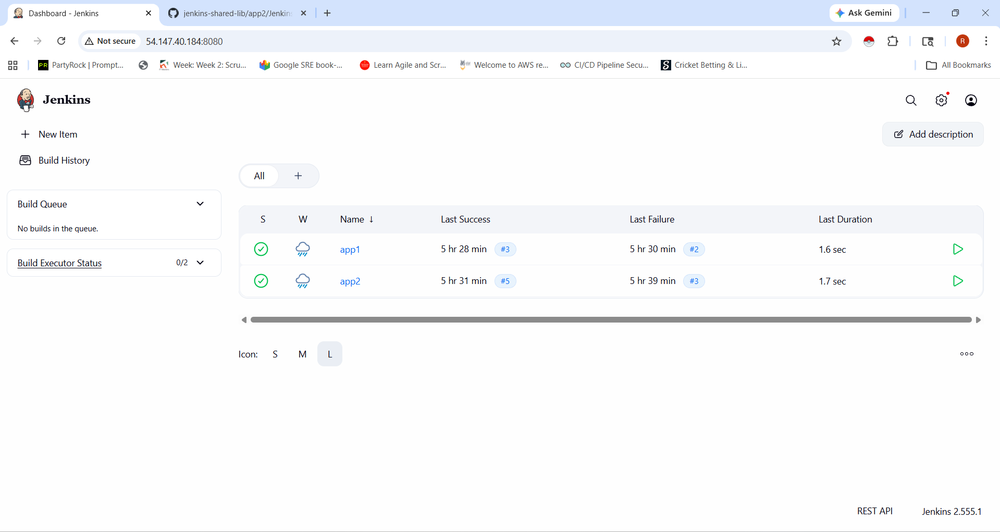
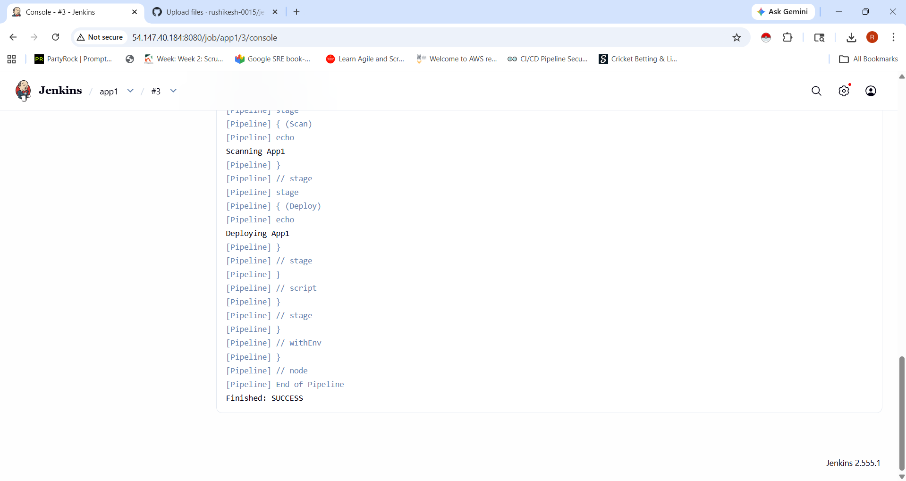
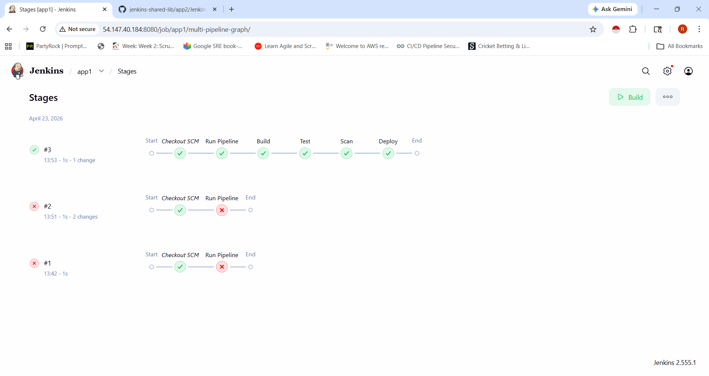

#  Centralized CI/CD Platform using Shared Jenkins Infrastructure

##  Project Overview

This project demonstrates how to build a **centralized CI/CD platform** using Jenkins, where multiple applications share a **standardized pipeline** using a **shared library**.

Instead of creating separate Jenkins setups for each team, this approach ensures:

* Reduced infrastructure duplication
* Standardized CI/CD pipelines
* Improved security and access control

---

## Architecture

* Source Code Management: GitHub
* CI/CD Tool: Jenkins
* Cloud Platform: Amazon Web Services (EC2)
* Containerization: Docker

### Workflow

1. Developer pushes code to GitHub
2. Jenkins pulls the code
3. Shared Library is loaded
4. Pipeline stages are executed:

   * Build
   * Test
   * Scan
   * Deploy

---

## Project Structure

### Shared Library Repository

```
jenkins-shared-lib/
 ├── vars/
 │    └── myPipeline.groovy
```

### Application Repositories

```
app1/
 └── Jenkinsfile

app2/
 └── Jenkinsfile
```

---

## Jenkins Setup

* Jenkins deployed on AWS EC2 instance
* Port 8080 enabled for access
* Docker installed for build support
* GitHub integrated for SCM

---

## Shared Pipeline Library

### myPipeline.groovy

```groovy
def call(Map config) {

    stage('Build') {
        echo "Building ${config.appName}"
    }

    stage('Test') {
        echo "Testing ${config.appName}"
    }

    stage('Scan') {
        echo "Scanning ${config.appName}"
    }

    stage('Deploy') {
        echo "Deploying ${config.appName}"
    }
}
```

---

## Jenkinsfile (Used in both applications)

```groovy
@Library('shared-lib') _

pipeline {
    agent any

    stages {
        stage('Run Pipeline') {
            steps {
                script {
                    myPipeline(appName: "App1")
                }
            }
        }
    }
}
```

> Note: For App2, replace `"App1"` with `"App2"`

---

## Role-Based Access Control (RBAC)

Implemented using Jenkins Role Strategy Plugin:

### Admin Role

* Full access to Jenkins
* Manage jobs, users, and configurations

### Developer Role

* Read access
* Build permission
* Restricted from admin settings

## 📸 Screenshots

### Jenkins Dashboard


### Pipeline Output


### Stage View


---

##  Features

* Centralized Jenkins setup
* Reusable shared pipeline library
* Multi-application support
* Standardized CI/CD stages
* Role-based access control

---

## Output

* Multiple Jenkins jobs (app1, app2)
* Same pipeline execution for both applications
* Successful stages:

  * Build
  * Test
  * Scan
  * Deploy

---

## Challenges Faced

* Jenkins shared library naming conflict
* Script security issues
* Pipeline syntax errors

### Solutions

* Renamed function to avoid `pipeline` keyword conflict
* Used Script Approval feature
* Standardized shared library structure

---

##  Conclusion

This project successfully demonstrates how to:

* Build a **scalable CI/CD platform**
* Enforce **pipeline standardization**
* Improve **security and maintainability**

---

## Future Enhancements

* Integrate SonarQube for code quality
* Add Docker build & push
* Deploy applications on EC2/Kubernetes
* Add Slack/email notifications

---
